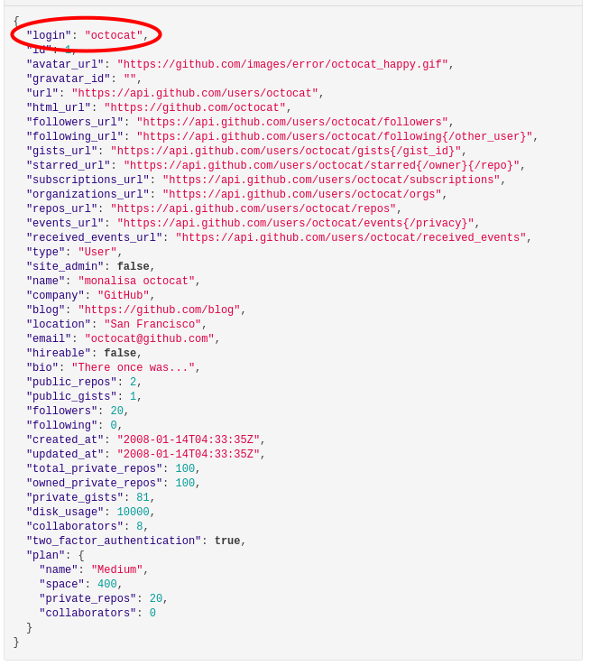

# OctoPrint-OAuth2

Plugin provides logging into OctoPrint via authorization protocol OAuth 2.0. Now this plugin overrides default logging in.
Default login is now provided by github and everybody logged in by this plugin has admin role. Possible configuration is below. 

## Setup

Install via the bundled [Plugin Manager](http://docs.octoprint.org/en/master/bundledplugins/pluginmanager.html)
or manually using this URL:

    https://github.com/Hanyman8/OctoPrint-OAuth2/archive/master.zip

You can install it via pip.

**Important:** Plugin is tested only on OctoPrint version 1.3.8

After installing plugin, you also need to configure your config.yaml and users.yaml
files. They are stored configuration folder (e.g. `~/.octoprint/` on Linux)`

## Configuration

If you want to be logged in via github api, you need to provide your
CLIENT_ID and CLIENT_SECRET into your .
Both are should be stored in config.yaml file. Under plugins section,
there should be list od your plugins, and now you need to put there
also configuration for plugin OAuth2.

### config.yaml

```yaml
plugins:
  oauth2:
```

Under your client, there have to be basic information about,
where to log in via OAuth2 used by `login_path`, then url where
the access token should be obtained in value `token_path`.  In `user_info_path`
has to be url, where information about user is stored. This information
from access token has to be in JSON therefore you can also set some headers for
plugin obtaining access token.

Resource servers use different keywords for username (e.g. name, username, user_id, login).
For plugin you need to specify that with `username_key`. After that you need to specify `access_token_query_key`.
That settings option is because some resource server needs query parameter "access_token" and some only "token".

```yaml
oauth2:
  login_path: https://github.com/login/oauth/authorize
  token_path: https://github.com/login/oauth/access_token
  user_info_path: https://api.github.com/user
  username_key: login
  access_token_query_key: access_token
  token_headers: # plugin needs access token in JSON, on some servers we need to configure it.
    Accept: application/json
```
Finnaly every client needs redirection_uri, client_id and client_secret.
Because one client application has only one redirection_uri, we need to specific
this in config file. OctoPrint can for example run on `0.0.0.0:5000` and
if we want to redirect back after authorization to `0.0.0.0:5000` and
not `localhost:5000` we have to specify that.

```yaml
oauth2:
  login_path: https://github.com/login/oauth/authorize
  token_path: https://github.com/login/oauth/access_token
  user_info_path: https://api.github.com/user
  username_key: login
  access_token_query_key: access_token
  token_headers: # plugin needs access token in JSON, on some servers we need to configure it.
    Accept: application/json
  http://localhost:5000/: #redirect_uri
    client_id: 5944a4d751a567c31 #example of client_id
    client_secret: 3a9314582de82304faq5865a2d565734 #example of secret
```

Anf finally here is an example of config.yaml configuration using more redirect_uris
on client.
```yaml
plugins:
  oauth2:
    login_path: https://github.com/login/oauth/authorize
    token_path: https://github.com/login/oauth/access_token
    user_info_path: https://api.github.com/user
    username_key: login
    access_token_query_key: access_token
    token_headers: # plugin needs access token in JSON, on some servers we need to configure it.
      Accept: application/json
    http://localhost:5000/: #redirect_uri from
      client_id: 5944a4d751a567c31 #example of client_id
      client_secret: 3a9314582de82304faq5865a2d565734 #example of secret
    http://0.0.0.0:5000/:
      client_id: 1cbef6227fa4b23ff
      client_secret: 9a6541ee16c6c0c3fe65825ff5c7df25
```
Note: this is not valid client_id and client_secret :+1:

### users.yaml

For congiguration users.yaml you have to set a user with admin role.
This user needs to have same username as the username from server, for example:
```yaml 
YourUsername1234:
  active: true
  apikey: null
  password: ''
  roles:
  - user
  - admin
  settings: {}
```
Every other user, who is logged via OAuth2 authentication isstored to users.yaml
file with role user. Through user interace admin can set his role to user later.

## Example for github
### Create github OAuth App
First you need to set up your own OAuth App on github.
You can find tutorial here: [create OAuth App](https://developer.github.com/apps/building-oauth-apps/creating-an-oauth-app/) 

### Set up your config.yaml
Then you need to provide to plugin configuration. You can find your OctoPrint configuration files in `~/.octoprint` on Linux
or in [%AppData%](https://www.howtogeek.com/318177/what-is-the-appdata-folder-in-windows/) on Windows. In `config.yaml` file you have to set:
 1. **login_path:** [Url, where you log in into github](https://developer.github.com/apps/building-oauth-apps/authorization-options-for-oauth-apps/#1-users-are-redirected-to-request-their-github-identity)
 2. **token_path:** [Url, where should plugin obtain access_token](https://developer.github.com/apps/building-oauth-apps/authorization-options-for-oauth-apps/#2-users-are-redirected-back-to-your-site-by-github)
 3. **user_info_path:** [Url, where plugin will get user information](https://developer.github.com/apps/building-oauth-apps/authorization-options-for-oauth-apps/#3-use-the-access-token-to-access-the-api) using `access_token`
 4. **username_key:** You need to provide, how the user would be logged in. Note: This username has to be unique,
 because it is stored in the users.yaml, where settings for this user are stored.
 
 5. **access_token_query_key:** Some resource server have different specification how to get data about user.
 For example github has query parameter: `access_token`. Other server might have query parameter just `token`
 6. **token_headers:** This plugin requires info in [JSON](https://en.wikipedia.org/wiki/JSON) format,
 for github you need to specify that with a header that is post to get `access_token`
 
 So now our `config.yaml` look like this:
 ```yaml
plugins: # List of your plugins and their configurations. If it is missing, add it too   
  oauth2: # Name of the plugin
    login_path: https://github.com/login/oauth/authorize
    token_path: https://github.com/login/oauth/access_token
    user_info_path: https://api.github.com/user
    username_key: login
    access_token_query_key: access_token
    token_headers:
      Accept: application/json
```
Now you need to set up url redirect [URIs](https://en.wikipedia.org/wiki/Uniform_Resource_Identifier). Some servers does not 
provide the possibility to have more than one `redirect_uri`, so you have to
make more OAuth2 Apps. For every `redirect_uri` there is one `client_id` and `client_secret`

**Simple Example:** You are running OctoPrint on "http://127.0.0.1:5000/", but
for personal reasons you want `redirect_uri` to be "http://localhost:5000/".
The problem is, that you specified the `redirect_uri` to be "http://127.0.0.1:5000/
 and the authentication fails.

 7. **redirect_uri_first:**
    1. **client_id:** your_client_id_first
    2. **client_secret:** your_client_secret_first
    
    **redirect_uri_second:**
    1. **client_id:** your_client_id_second
    2. **client_secret:** your_client_secret_second

Final configuration for using OctoPrint-Outh2 on github is:
```yaml
plugins:
  oauth2:
    login_path: https://github.com/login/oauth/authorize
    token_path: https://github.com/login/oauth/access_token
    user_info_path: https://api.github.com/user
    username_key: login
    access_token_query_key: access_token
    token_headers: # plugin needs access token in JSON, on some servers we need to configure it.
      Accept: application/json
    http://localhost:5000/: #redirect_uri where you run OctoPrint
      client_id: your_client_id_first 
      client_secret: your_client_secret_first 
    http://0.0.0.0:5000/: # second possibility where you run OctoPrint with different client_id and client_secret
      client_id: your_client_id_second
      client_secret: your_client_secret_second
```

### Setup your users.yaml

Second, your need to make your own users.yaml file. You can find it in the directory, where config.yaml is.
And here is example, how it should look.

```yaml 
your_github_username:
  active: true
  apikey: null
  password: ''
  roles:
  - user
  - admin
  settings: {}
```
Every other user logged with OctoPrint-OAuth2 plugin would have role `user` and will be stored in `users.yaml` too.
If you need admin for your new user, you can change it logged in as an admin in the user interface settings or
manually change your `users.py` file.

If you need more information about configuring OctoPrint see its [documentation.](http://docs.octoprint.org/en/master/configuration/index.html)


# OctoPrint-OAuth2
